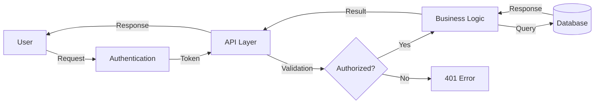

<!--
  ┌─────────────────────────────────────────────────────────────────────────┐
  │  This is a TEMPLATE. Before publishing your project:                       │
  │  1. Read TEMPLATE-USAGE.md to learn how to instantiate it.                 │
  │  2. Replace every [PLACEHOLDER] (find them with grep, see the guide).      │
  │  3. Delete the documents that don't apply to your project.                 │
  │  4. Remove this comment.                                                   │
  └─────────────────────────────────────────────────────────────────────────┘
-->

# [PROJECT_NAME]

Short, concise description of the project (1-2 lines).


## Table of Contents

- [Description](#description)
- [Features](#features)
- [Prerequisites](#prerequisites)
- [Installation](#installation)
- [Configuration](#configuration)
- [Usage](#usage)
- [Architecture](#architecture)
- [Tech Stack](#tech-stack)
- [Available Scripts](#available-scripts)
- [Testing](#testing)
- [Deployment](#deployment)
- [Contributing](#contributing)
- [Troubleshooting](#troubleshooting)
- [Roadmap](#roadmap)
- [Documentation](#documentation)
- [AI / Agents](#ai--agents)
- [Support](#support)
- [Versioning](#versioning)
- [Authors](#authors)
- [License](#license)
- [Support Us](#support-us)
- [Acknowledgments](#acknowledgments)

## Description

Detailed description of the project, its purpose and the problem it solves. Explain the context and how this project adds value.

### How It Works



## Features

- ✅ Main feature 1
- ✅ Main feature 2
- ✅ Main feature 3
- 🚧 Feature in progress
- 📋 Planned feature

## Prerequisites

Before you begin, make sure you have installed:

- **[RUNTIME]**: v[VERSION] or higher
- **[PACKAGE_MANAGER]**: v[VERSION] or higher
- **[DATABASE]**: v[VERSION] or higher
- **[OTHER_TOOL]**: v[VERSION] or higher

### Required Access

- Access to the repository
- Credentials for [SERVICE/API]
- [OTHER_ACCESS] (if applicable)

## Installation

### 1. Clone the repository

```bash
git clone [REPOSITORY_URL]
cd [PROJECT_NAME]
```

### 2. Install dependencies

```bash
[INSTALL_DEPENDENCIES_COMMAND]
```

### 3. Configure environment variables

```bash
cp .env.example .env
# Edit .env with your credentials
```

### 4. Initialize the database (if applicable)

```bash
[MIGRATIONS_COMMAND]
[SEEDS_COMMAND]
```

## Configuration

Environment variables are documented in [`.env.example`](.env.example). Copy it to `.env` and fill in the values for your environment.

> Never commit your `.env` file with real values to the repository. See [SECURITY.md](SECURITY.md) and [`docs/conventions/secrets.md`](docs/conventions/secrets.md).

## Usage

### Local development

```bash
[START_DEV_COMMAND]
# The app will be available at http://localhost:[PORT]
```

### Usage examples

```bash
# Example command or representative call
[EXAMPLE]
```

For the full API contract, see [`docs/architecture/api.md`](docs/architecture/api.md).

## Architecture

Summary of how the system is built. Full detail in [`docs/architecture/architecture.md`](docs/architecture/architecture.md).

## Tech Stack

Summary of the main technologies. Full inventory (with versions and rationale) in [`docs/architecture/stack.md`](docs/architecture/stack.md).

## Available Scripts

```bash
[DEV_COMMAND]   # Start in development mode
[BUILD_COMMAND]        # Build for production
[TEST_COMMAND]         # Run tests
[LINT_COMMAND]         # Linting / formatting
```

## Testing

```bash
[TEST_COMMAND]            # All tests
[TEST_COVERAGE_COMMAND]  # With coverage report
```

Testing conventions in [`docs/conventions/testing.md`](docs/conventions/testing.md).

## Deployment

| Environment | URL              | Branch    | Deploy    |
| ----------- | ---------------- | --------- | --------- |
| Development | [DEV_URL]        | `develop` | Automatic |
| Staging     | [STAGING_URL]    | `staging` | Automatic |
| Production  | [PRODUCTION_URL] | `main`    | Manual    |

Detailed procedure in [`docs/conventions/deploy.md`](docs/conventions/deploy.md).

## Contributing

Read the [Contributing Guide](CONTRIBUTING.md) to learn about the workflow (Git Flow), code standards, commit format (Conventional Commits) and the Pull Request process.

## Troubleshooting

#### Error: "[COMMON_ERROR_MESSAGE]"

```bash
# Steps to diagnose and fix
[COMMAND]
```

### Getting help

1. Check the [documentation](docs/README.md).
2. Search the [existing issues]([REPOSITORY_URL]/issues).
3. Open a new issue or contact [SUPPORT_EMAIL].

## Roadmap

Vision and next steps in [`docs/product/roadmap.md`](docs/product/roadmap.md).

## Documentation

All documentation lives under [`docs/`](docs/README.md):

| Document                                                                 | Answers                                       |
| ------------------------------------------------------------------------ | --------------------------------------------- |
| [`docs/architecture/architecture.md`](docs/architecture/architecture.md) | How is it built?                              |
| [`docs/architecture/stack.md`](docs/architecture/stack.md)               | With which technologies?                      |
| [`docs/architecture/database.md`](docs/architecture/database.md)         | What entities and relationships?              |
| [`docs/architecture/api.md`](docs/architecture/api.md)                   | What endpoints does it expose?                |
| [`docs/architecture/auth.md`](docs/architecture/auth.md)                 | How does authentication & authorization work? |
| [`docs/architecture/design.md`](docs/architecture/design.md)             | How is it designed and why?                   |
| [`docs/product/business-model.md`](docs/product/business-model.md)       | Why does it exist / how does it create value? |
| [`docs/product/roadmap.md`](docs/product/roadmap.md)                     | Where is it headed?                           |
| [`docs/decisions/`](docs/decisions/README.md)                            | Why did we make each decision?                |
| [`docs/conventions/`](docs/conventions/README.md)                        | How do we work in this repo?                  |

## AI / Agents

This template is **AI-ready**. Agent context lives in [`AGENTS.md`](AGENTS.md)
(canonical; [`CLAUDE.md`](CLAUDE.md) imports it for Claude Code). Reusable
[subagents](.claude/agents) and [skills](.claude/skills) ship as adaptable
examples, and there's a lightweight spec-driven flow in [`specs/`](specs/README.md).
See [`docs/conventions/ai-agents.md`](docs/conventions/ai-agents.md) for the rules.

## Support

Problems or suggestions? Open an issue in [the repository]([REPOSITORY_URL]/issues) or write to [SUPPORT_EMAIL].

## Versioning

We use [Git](https://git-scm.com) for version control and follow [Semantic Versioning](https://semver.org/). Check the [tags]([REPOSITORY_URL]/tags) for available versions and the [CHANGELOG](CHANGELOG.md).

## Authors

- **[AUTHOR]** — _Initial work_ — [@[GITHUB_USER]](https://github.com/[GITHUB_USER])

See also the list of [contributors]([REPOSITORY_URL]/contributors).

## License

This project is licensed under the [MIT](LICENSE) license.

## Support Us

If you find this project useful and want to support its development:

- [GitHub Sponsors](https://github.com/sponsors/[GITHUB_USER])
- [Ko-fi](https://ko-fi.com/[GITHUB_USER])
- [Patreon](https://patreon.com/[GITHUB_USER])

## Acknowledgments

Thanks to everyone who contributes to this project. If you find value in it, you can:

- Share the project 📤
- Buy a coffee ☕
- Open an issue or PR 🙌
- Leave your thanks with a comment 💬

---

⌨️ with ❤️ by [@[GITHUB_USER]](https://github.com/[GITHUB_USER])
