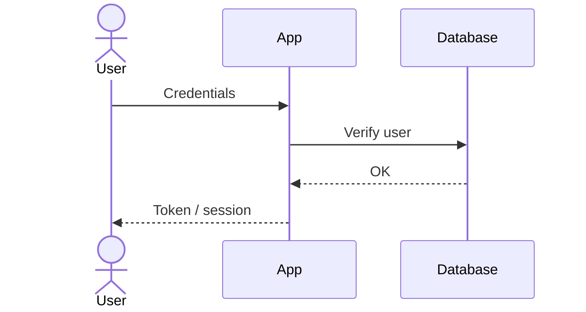

# Authentication and Authorization

> How users are authenticated and authorized in **[PROJECT_NAME]**.
> For the cross-cutting rules see [`../conventions/authentication.md`](../conventions/authentication.md).
>
> **Last updated**: [DATE]

## Overview

- **Authentication method**: [session / JWT / OAuth / SSO].
- **Credential storage**: [where and how].
- **Password hashing**: [bcrypt / argon2 / …].

## Identity model

| Concept         | Description                            |
| --------------- | -------------------------------------- |
| User            | [What it represents, key fields]       |
| Session / Token | [How an active session is represented] |
| Roles           | [Existing roles and their meaning]     |

## Registration / login flow

## Session / token management

- **Expiration**: [TTL].
- **Renewal**: [refresh tokens / rotation].
- **Revocation**: [how a session is invalidated].

## Authorization

- **Model**: [RBAC / ABAC / per-resource permissions].
- **Where it is validated**: always on the server, on every request.
- **Roles and permissions**:

| Role     | Permissions      |
| -------- | ---------------- |
| [ROLE_1] | [What it can do] |
| [ROLE_2] | [What it can do] |

## External providers (OAuth / SSO)

- [Provider], server-side validation, data consumed.

## Account recovery

- [Password reset, email change, verification flow].

## Security considerations

See [SECURITY.md](../../SECURITY.md) for the complete policy.
