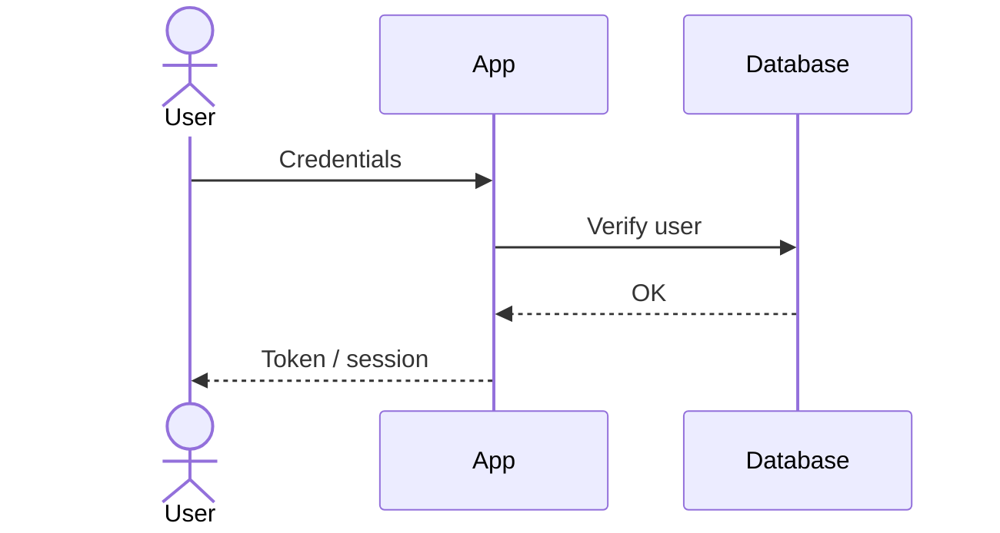

# Authentication and Authorization

> How users are authenticated and authorized in **[PROJECT_NAME]** — this project's model
> AND the rules that do not change when the tool changes. (It used to be an
> `architecture/` + `conventions/` pair with the same table on both sides; they were
> merged because they were always filled in and pruned together.)
>
> **Last updated**: [DATE]

## Overview

- **Authentication method**: [session / JWT / OAuth / SSO].
- **Credential storage**: [where and how].
- **Password hashing**: [bcrypt / argon2 / …].

## Rules (they hold for any stack)

- Authorization is validated **always on the server**, on every request. Never trust
  client-side checks for security decisions.
- Passwords are stored hashed with a robust algorithm and a salt.
- Tokens/sessions are rotated on every login and have an expiry.
- OAuth/SSO flows are validated server-side (email and UID).
- **Collecting personal data from someone who is not a user requires their own consent**,
  at the point where it is collected. Accepting terms when creating an account does not
  cover someone who never created one. It conditions the design of that screen, so it is
  decided before building it.

## Actors

Everyone who interacts with the system, **including those with no account**. This table
comes before the roles on purpose: an actor with no session also has authorization to
define, and it is the one most easily forgotten.

| Actor     | Has an account? | Credential                   | What they can see and do |
| --------- | --------------- | ---------------------------- | ------------------------ |
| [ACTOR_1] | Yes             | Session                      | [scope]                  |
| [ACTOR_2] | No              | [signed link · token · none] | [scope]                  |

For every actor with no account, also answer: **does their credential expire?** can it be
shared? what happens if somebody copies it? A token printed, emailed or placed in a URL is
public in practice: anyone who sees it has it. If personal data hangs off it, decide what
is shown **before** building it.

## Identity model

| Concept         | Description                            |
| --------------- | -------------------------------------- |
| User            | [What it represents, key fields]       |
| Session / Token | [How an active session is represented] |
| Roles           | [Existing roles and their meaning]     |

## Sign-up / login flow

```mermaid
sequenceDiagram
    actor U as User
    participant A as App
    participant DB as Database
    U->>A: Credentials
    A->>DB: Verify user
    DB-->>A: OK
    A-->>U: Token / session
```

## Session / token management

- **Expiry**: [TTL].
- **Renewal**: [refresh tokens / rotation].
- **Revocation**: [how a session is invalidated].

## Authorization

- **Model**: [RBAC / ABAC / per-resource permissions].
- **Roles and permissions**:

| Role     | Permissions        |
| -------- | ------------------ |
| [ROLE_1] | [What they can do] |
| [ROLE_2] | [What they can do] |

## External providers (OAuth / SSO)

- [Provider], server-side validation, data consumed.

> **If the app is going to the App Store with social login**, guideline 4.8 requires an
> equivalent privacy-preserving alternative — the detail lives in
> [`../conventions/deploy.md`](../conventions/deploy.md) §"Before the first submission"
> (single copy), alongside the other publishing requirements. Decide it here, not at
> publishing time.

## Account recovery

- [Password reset flow, email change, verification].

## Security considerations

See [SECURITY.md](../../SECURITY.md) for the full policy.
