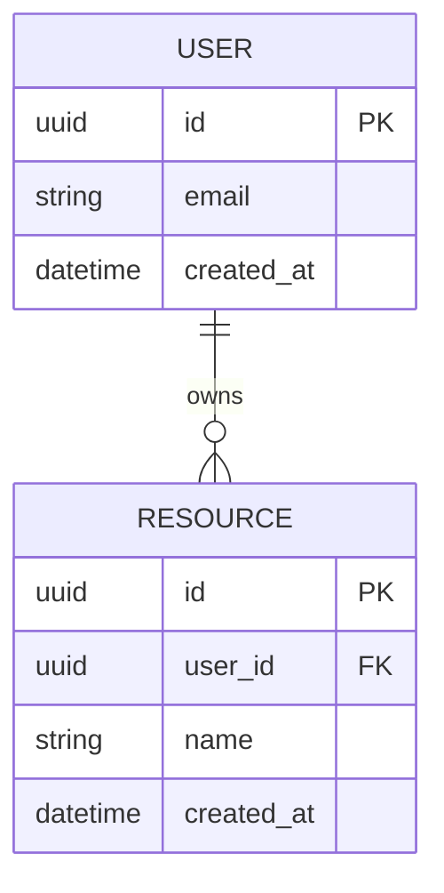

# Data Model

> Schema, entities and relationships of **[PROJECT_NAME]**.
> For the modeling **rules and standards** (naming, types, indexes)
> see [`../conventions/database.md`](../conventions/database.md).
>
> **Last updated**: [DATE]

## Entity-Relationship Diagram

## Main entities

### [ENTITY_1]

- **Purpose**: [What it represents].
- **Key fields**: [field (type) — description].
- **Relationships**: [with which other entities and with what cardinality].

### [ENTITY_2]

- **Purpose**: [What it represents].
- **Key fields**: [field (type) — description].
- **Relationships**: [with which other entities and with what cardinality].

## Relationships and cardinality

| Relationship            | Cardinality | Notes            |
| ----------------------- | ----------- | ---------------- |
| [ENTITY_A] → [ENTITY_B] | 1:N         | [Integrity rule] |

## Indexes and constraints

- [Important index/constraint and why it exists].
- [Uniqueness, FK, check constraint, etc.].

## Migrations and schema versioning

- [How migrations are generated and applied — `[MIGRATIONS_COMMAND]`].
- [Policy for reversible / non-destructive migrations].

## Seed data (seeds)

- [What base data is loaded and with which command — `[SEEDS_COMMAND]`].
