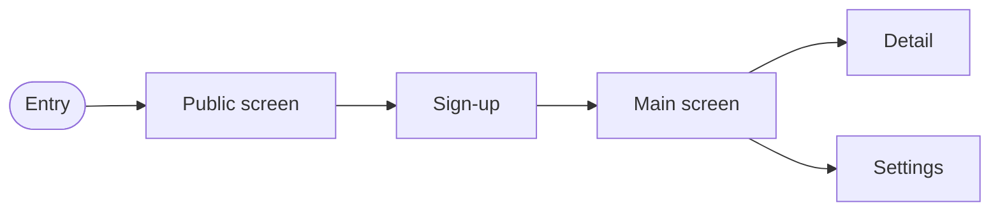

# Screen map — [PROJECT_NAME]

> Which screens the product has, what each one is for and **where it stands**. It is the
> output of the "Map" step ([`../conventions/workflow.md`](../conventions/workflow.md))
> and the UI progress board: it gets updated every time a view changes state.
>
> This is **not** where you decide how it looks (that is
> [`design/`](../../design/README.md)) nor how the view code is organized (that is
> [`../conventions/ui.md`](../conventions/ui.md)). The design decisions of a specific
> change go in its spec's `design.md`; the lasting ones, in an
> [ADR](../decisions/README.md).
>
> **Last updated**: [DATE]

## States

| State         | Means                                                              |
| ------------- | ------------------------------------------------------------------ |
| **map**       | The decision that it is needed exists. Nothing built.              |
| **prototype** | Laid out statically with `/prototype`, navigable and criticizable. |
| **connected** | With real data, its four states and reviewed in both themes.       |

A view does not become **connected** without loading, empty, error and success — see
[`../conventions/ui.md`](../conventions/ui.md).

## Screens

Start from the standard catalog (public, legal, auth, app) and add the ones from the
critical journey, so none gets discovered mid-development.

| View       | Route   | Purpose             | State |
| ---------- | ------- | ------------------- | ----- |
| [Landing]  | `/`     | [Convert a visitor] | map   |
| [Own view] | [/path] | [Value action]      | map   |

## Navigation map

How each screen is reached. It is the site map and the user flow at once: the nodes are
the screens in the table above and the arrows, what the person can do. **It gets updated
in the same PR that adds or removes a screen** — an outdated diagram is worse than none,
because it reads as authority and nobody verifies it.

> Replace the nodes with yours. If the product **has no interface**, delete this whole
> section and the document: a CLI's surface is described in
> [`architecture.md`](architecture.md) (see the no-interface variant in
> [`../conventions/workflow.md`](../conventions/workflow.md)).

## Critical journey

The path v1 must make flawless, in order (the journey that makes the product worth it):

[view → view → view]

## Screens that will not exist

What was decided **not** to build, so it does not get re-discussed every time somebody
misses it:

| Discarded view | Why | What signal would bring it in? |
| -------------- | --- | ------------------------------ |
|                |     |                                |
